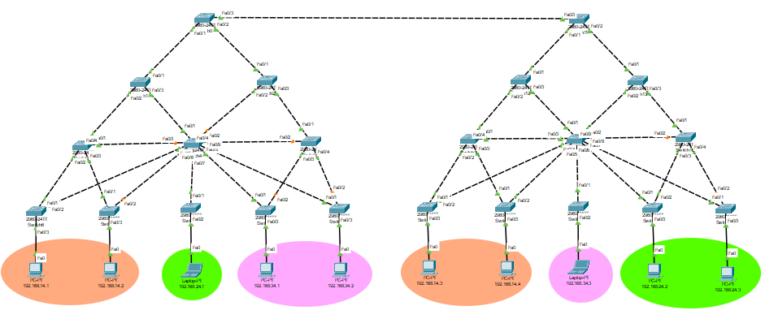

# MANUAL 

## Introduccion

Este manual presenta los resultados obtenidos de la practica 1 del curso redes de computadoras 2, la cual se enfoca en la configuracion de una red LAN de un colegio utilizando la plataforma Packet Tracer.

## Objetivo

El objetivo principal de este manual es familiarizar a los usuarios con los conceptos basicos de diseño y configuracion de redes LAN a través de una practica realizada en Packet Tracer.

### Topologia

A continuacion se muestra la topologia de la red completa.

### VLANs

Tabla de VLANs pertenecientes a cada departamento.

| Departamento  | Nombre          | No |
|---------------|-----------------|----|
| Primaria      | Primaria14      | 14 |
| Basicos       | Basicos24       | 24 |
| Diversificado | Diversificado34 | 34 |

### Tiempos de convergencia [En segundos]

| Escenario  | Protocolo Spanning-Tree | Red Primaria | Red Básicos | Red Diversificado |
|------------|-------------------------|--------------|-------------|-------------------|
| 1          | PVST                    |       45     |     40      |        43         |
| 2          | Rapid PVST              |       8      |    7.64     |         0         |

Según los tiempos de convergencia, la mejor opción  es Rapid PVST, el tiempo dependerá de que enlace caiga, pero es notable que independientemente de eso los tiempo de RPVST son mucho menores a PVST.

## Construido con

Para la creacion de la practica se utilizaron los siguientes programas de simulacion de redes:

* [Packet Tracer](https://www.netacad.com/es/courses/packet-tracer) - Usado para la creacion total de la practica.

## Autores

* [201700686 Cristofher Antonio Saquilmer Rodas](https://github.com/CristofherS)
* [201700700 Luis Fernando Falla Guzmán        ](https://github.com/fernandofalla)
* [202000605 Camilo Ernesto Sincal Sipac       ](https://github.com/CamiloSincal)
* [202000562 Pedro Luis Pu Tavico              ](https://github.com/luis-tavico)
