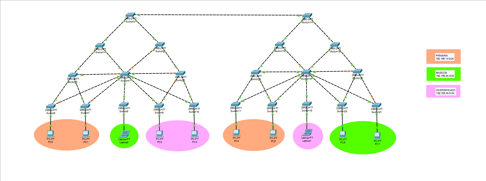

# Practica 1 - Manual Técnico
---
UNIVERSIDAD DE SAN CARLOS DE GUATEMALA
FACULTAD DE INGENIERÍA
ESCUELA DE CIENCIAS Y SISTEMAS
REDES DE COMPUTADORAS 2
ING. ALLAN ALBERTO MORATAYA GÓMEZ
AUX: EDUARDO IXÉN

---

## Integrantes

| Nombre                                | Carnet    |
|:------------------------------------- |:---------:|
| Luis Fernando Falla Guzmán            | 201700700 |
| Cristofher Antonio Saquilmer Rodas    | 201700686 |
| Pedro Luis Pu Tavico                  | 202000562 |
| Camilo Ernesto Sincal Sipac           | 202000605 |

## Introducción
Este manual presenta los resultados obtenidos de la practica 1 del curso redes de computadoras 2, la cual se enfoca en la configuracion de una red LAN de un colegio utilizando la plataforma Packet Tracer.

## Objetivos
- Familiarizarse con el simulador Cisco Packet Tracer.
- Realizar las configuraciones básicas del switch.
- Configurar y conocer el funcionamiento de las VLAN.
- Configurar y conocer los tipos de acceso en los puertos.
- Configurar y conocer el protocolo VTP con sus distintos modos.
- Configurar y conocer la comunicación entre distintas VLAN.
- Comprender el funcionamiento de STP, sus distintas versiones y los estados de las interfaces.
- Aplicar las medidas de seguridad en los puertos de un switch.

## Topología


## VTP
```
Dominio = g4
Contraseña = redes2grupo4
Switch Servidor = SW0_G4
```

## VLAN's y Direcciones de Red

| Departamento  | VLAN  | IP                |
|:------------- |:-----:| :---------------: |
| Primaria      | 14    | 192.168.14.0/24   |
| Básicos       | 24    | 192.168.24.0/24   |
| Diversificado | 34    | 192.168.34.0/24   |

## Convergencia PVST vrs RPVST

| Escenario  | Protocolo Spanning-Tree | Red Primaria | Red Básicos | Red Diversificado |
|:----------:|:-----------------------:|:------------:|:------:|:-----------------:|
| 1          | PVST                    |       45     |     40      |        43         |
| 2          | RPVST              |       6      |      6      |         7         |

Según los tiempos de convergencia, la mejor opción  es Rapid PVST, el tiempo dependerá de que enlace caiga, pero es notable que independientemente de eso los tiempo de RPVST son mucho menores a PVST.

### PVST


### RPVST


## Configuración de switches

### SW0_G4 (servidor vtp y raiz stp)

```
enable
configure terminal
hostname SW0_G4
end
write

! modo troncal

configure terminal
interface range fastEthernet 0/1-3
switchport mode trunk
switchport nonegotiate
end
write

! Revisar modo troncal: show interfaces trunk
! creacion de VLANs

configure terminal
vlan 14
name Primaria14
vlan 24
name Basicos24
vlan 34
name Diversificado34
end
write

! Revisar creacion de VLANs: show vlan brief
! Modo servidor

configure terminal
vtp version 2
vtp mode server
vtp domain g4
vtp password redes2grupo4
end
write

! Revisar vtp creado: show vtp status
! Spanning tree protocol - PVST

configure terminal
spanning-tree mode rapid-pvst
spanning-tree vlan 14,24,34 root primary
end
write

! Revisar STP: show spanning-tree ó show spanning-tree summary
```


### SW11_G4 

```
enable
configure terminal
hostname SW11_G4
end
write

! Modo troncal

configure terminal
interface range fastEthernet 0/1-3
switchport mode trunk
switchport nonegotiate
end
write

! Revisar modo troncal: show interfaces trunk
! Modo cliente

configure terminal
vtp mode client
vtp domain g4
vtp password redes2grupo4
end
write

! Revisar vtp creado: show vtp status
! Spanning tree protocol - PVST

configure terminal
spanning-tree mode rapid-pvst
spanning-tree vlan 14,24,34 root secondary
end
write

! Revisar STP: show spanning-tree ó show spanning-tree summary
```

### SW1_G4

```
enable
configure terminal
hostname SW1_G4
end
write

! Modo troncal

configure terminal
interface range fastEthernet 0/1-3
switchport mode trunk
switchport nonegotiate
end
write

! Revisar modo troncal: show interfaces trunk
! Modo cliente

configure terminal
vtp mode client
vtp domain g4
vtp password redes2grupo4
end
write

! Revisar vtp creado: show vtp status
! Spanning tree protocol - PVST

configure terminal
spanning-tree mode rapid-pvst
end
write

! Revisar STP: show spanning-tree ó show spanning-tree summary
```


### SW2_G4

```
enable
configure terminal
hostname SW2_G4
end
write

! Modo troncal

configure terminal
interface range fastEthernet 0/1-3
switchport mode trunk
switchport nonegotiate
end
write

! Revisar modo troncal: show interfaces trunk
! Modo cliente

configure terminal
vtp mode client
vtp domain g4
vtp password redes2grupo4
end
write

! Revisar vtp creado: show vtp status
! Spanning tree protocol - PVST

configure terminal
spanning-tree mode rapid-pvst
end
write

! Revisar STP: show spanning-tree ó show spanning-tree summary
```

### SW3_G4

```
enable
configure terminal
hostname SW3_G4
end
write

! Modo troncal

configure terminal
interface range fastEthernet 0/1-4
switchport mode trunk
switchport nonegotiate
end
write

! Revisar modo troncal: show interfaces trunk
! Modo cliente

configure terminal
vtp mode client
vtp domain g4
vtp password redes2grupo4
end
write

! Revisar vtp creado: show vtp status
! Spanning tree protocol - PVST

configure terminal
spanning-tree mode rapid-pvst
end
write

! Revisar STP: show spanning-tree ó show spanning-tree summary
```

### SW4_G4

```
enable
configure terminal
hostname SW4_G4
end
write

! Modo troncal

configure terminal
interface range fastEthernet 0/1-9
switchport mode trunk
switchport nonegotiate
end
write

! Revisar modo troncal: show interfaces trunk
! Modo cliente

configure terminal
vtp mode client
vtp domain g4
vtp password redes2grupo4
end
write

! Revisar vtp creado: show vtp status
! Spanning tree protocol - PVST

configure terminal
spanning-tree mode rapid-pvst
end
write

! Revisar STP: show spanning-tree ó show spanning-tree summary
```

### SW5_G4

```
enable
configure terminal
hostname SW5_G4
end
write

! Modo troncal

configure terminal
interface range fastEthernet 0/1-4
switchport mode trunk
switchport nonegotiate
end
write

! Revisar modo troncal: show interfaces trunk
! Modo cliente

configure terminal
vtp mode client
vtp domain g4
vtp password redes2grupo4
end
write

! Revisar vtp creado: show vtp status
! Spanning tree protocol - PVST

configure terminal
spanning-tree mode rapid-pvst
end
write

! Revisar STP: show spanning-tree ó show spanning-tree summary
```

### SW6_G4

```
enable
configure terminal
hostname SW6_G4
end
write

! Modo troncal

configure terminal
interface range fastEthernet 0/1-3
switchport mode trunk
switchport nonegotiate
end
write

! Revisar modo troncal: show interfaces trunk
! Modo cliente

configure terminal
vtp mode client
vtp domain g4
vtp password redes2grupo4
end
write

! Revisar vtp creado: show vtp status
! Modo acceso

configure terminal
interface fastEthernet 0/3
switchport mode access
switchport access vlan 14
switchport port-security
switchport port-security maximum 1
switchport port-security mac-address sticky
end
write

! Verificar vlan: show vlan brief
! Spanning tree protocol - PVST

configure terminal
spanning-tree mode rapid-pvst
end
write

! Revisar STP: show spanning-tree ó show spanning-tree summary
```

### SW7_G4

```
enable
configure terminal
hostname SW7_G4
end
write

! Modo troncal

configure terminal
interface range fastEthernet 0/1-3
switchport mode trunk
switchport nonegotiate
end
write

! Revisar modo troncal: show interfaces trunk
! Modo cliente

configure terminal
vtp mode client
vtp domain g4
vtp password redes2grupo4
end
write

! Revisar vtp creado: show vtp status
! Modo acceso

configure terminal
interface fastEthernet 0/3
switchport mode access
switchport access vlan 14
switchport port-security
switchport port-security maximum 1
switchport port-security mac-address sticky
end
write

! Verificar vlan: show vlan brief
! Spanning tree protocol - PVST

configure terminal
spanning-tree mode rapid-pvst
end
write

! Revisar STP: show spanning-tree ó show spanning-tree summary
```


### SW8_G4

```
enable
configure terminal
hostname SW8_G4
end
write

! Modo troncal

configure terminal
interface range fastEthernet 0/1-2
switchport mode trunk
switchport nonegotiate
end
write

! Revisar modo troncal: show interfaces trunk
! Modo cliente

configure terminal
vtp mode client
vtp domain g4
vtp password redes2grupo4
end
write

! Revisar vtp creado: show vtp status
! Modo acceso

configure terminal
interface fastEthernet 0/2
switchport mode access
switchport access vlan 24
switchport port-security
switchport port-security maximum 1
switchport port-security mac-address sticky
end
write

! Verificar vlan: show vlan brief
! Spanning tree protocol - PVST

configure terminal
spanning-tree mode rapid-pvst
end
write

! Revisar STP: show spanning-tree ó show spanning-tree summary
```

### SW9_G4

```
enable
configure terminal
hostname SW9_G4
end
write

! Modo troncal

configure terminal
interface range fastEthernet 0/1-3
switchport mode trunk
switchport nonegotiate
end
write

! Revisar modo troncal: show interfaces trunk
! Modo cliente

configure terminal
vtp mode client
vtp domain g4
vtp password redes2grupo4
end
write

! Revisar vtp creado: show vtp status
! Modo acceso

configure terminal
interface fastEthernet 0/3
switchport mode access
switchport access vlan 34
switchport port-security
switchport port-security maximum 1
switchport port-security mac-address sticky
end
write

! Verificar vlan: show vlan brief
! Spanning tree protocol - PVST

configure terminal
spanning-tree mode rapid-pvst
end
write

! Revisar STP: show spanning-tree ó show spanning-tree summary
```

### SW10_G4

```
enable
configure terminal
hostname SW10_G4
end
write

! Modo troncal

configure terminal
interface range fastEthernet 0/1-3
switchport mode trunk
switchport nonegotiate
end
write

! Revisar modo troncal: show interfaces trunk
! Modo cliente

configure terminal
vtp mode client
vtp domain g4
vtp password redes2grupo4
end
write

! Revisar vtp creado: show vtp status
! Modo acceso

configure terminal
interface fastEthernet 0/3
switchport mode access
switchport access vlan 34
switchport port-security
switchport port-security maximum 1
switchport port-security mac-address sticky
end
write

! Verificar vlan: show vlan brief
! Spanning tree protocol - PVST

configure terminal
spanning-tree mode rapid-pvst
end
write

! Revisar STP: show spanning-tree ó show spanning-tree summary
```

### SW12_G4

```
enable
configure terminal
hostname SW12_G4
end
write

! Modo troncal

configure terminal
interface range fastEthernet 0/1-3
switchport mode trunk
switchport nonegotiate
end
write

! Revisar modo troncal: show interfaces trunk
! Modo cliente

configure terminal
vtp mode client
vtp domain g4
vtp password redes2grupo4
end
write

! Revisar vtp creado: show vtp status
! Spanning tree protocol - PVST

configure terminal
spanning-tree mode rapid-pvst
end
write

! Revisar STP: show spanning-tree ó show spanning-tree summary
```

### SW13_G4

```
enable
configure terminal
hostname SW13_G4
end
write

! Modo troncal

configure terminal
interface range fastEthernet 0/1-3
switchport mode trunk
switchport nonegotiate
end
write

! Revisar modo troncal: show interfaces trunk
! Modo cliente

configure terminal
vtp mode client
vtp domain g4
vtp password redes2grupo4
end
write

! Revisar vtp creado: show vtp status
! Spanning tree protocol - PVST

configure terminal
spanning-tree mode rapid-pvst
end
write

! Revisar STP: show spanning-tree ó show spanning-tree summary
```

### SW14_G4

```
enable
configure terminal
hostname SW14_G4
end
write

! Modo troncal

configure terminal
interface range fastEthernet 0/1-4
switchport mode trunk
switchport nonegotiate
end
write

! Revisar modo troncal: show interfaces trunk
! Modo cliente

configure terminal
vtp mode client
vtp domain g4
vtp password redes2grupo4
end
write

! Revisar vtp creado: show vtp status
! Spanning tree protocol - PVST

configure terminal
spanning-tree mode rapid-pvst
end
write

! Revisar STP: show spanning-tree ó show spanning-tree summary
```

### SW15_G4

```
enable
configure terminal
hostname SW15_G4
end
write

!  Modo troncal

configure terminal
interface range fastEthernet 0/1-9
switchport mode trunk
switchport nonegotiate
end
write

! Revisar modo troncal: show interfaces trunk
! Modo cliente

configure terminal
vtp mode client
vtp domain g4
vtp password redes2grupo4
end
write

! Revisar vtp creado: show vtp status
! Spanning tree protocol - PVST

configure terminal
spanning-tree mode rapid-pvst
end
write

! Revisar STP: show spanning-tree ó show spanning-tree summary
```

### SW16_G4

```
enable
configure terminal
hostname SW16_G4
end
write

! Modo troncal

configure terminal
interface range fastEthernet 0/1-4
switchport mode trunk
switchport nonegotiate
end
write

! Revisar modo troncal: show interfaces trunk
! Modo cliente

configure terminal
vtp mode client
vtp domain g4
vtp password redes2grupo4
end
write

! Revisar vtp creado: show vtp status
! Spanning tree protocol - PVST

configure terminal
spanning-tree mode rapid-pvst
end
write

! Revisar STP: show spanning-tree ó show spanning-tree summary
```

### SW17_G4

```
enable
configure terminal
hostname SW17_G4
end
write
! Modo troncal

configure terminal
interface range fastEthernet 0/1-3
switchport mode trunk
switchport nonegotiate
end
write

! Revisar modo troncal: show interfaces trunk
! Modo cliente

configure terminal
vtp mode client
vtp domain g4
vtp password redes2grupo4
end
write

! Revisar vtp creado: show vtp status
! Modo acceso

configure terminal
interface fastEthernet 0/3
switchport mode access
switchport access vlan 14
switchport port-security
switchport port-security maximum 1
switchport port-security mac-address sticky
end
write

! Verificar vlan: show vlan brief
! Spanning tree protocol - PVST

configure terminal
spanning-tree mode rapid-pvst
end
write

! Revisar STP: show spanning-tree ó show spanning-tree summary
```

### SW18_G4

```
enable
configure terminal
hostname SW18_G4
end
write

! Modo troncal

configure terminal
interface range fastEthernet 0/1-3
switchport mode trunk
switchport nonegotiate
end
write

! Revisar modo troncal: show interfaces trunk
! Modo cliente

configure terminal
vtp mode client
vtp domain g4
vtp password redes2grupo4
end
write

! Revisar vtp creado: show vtp status
! Modo acceso

configure terminal
interface fastEthernet 0/3
switchport mode access
switchport access vlan 14
switchport port-security
switchport port-security maximum 1
switchport port-security mac-address sticky
end
write

! Verificar vlan: show vlan brief
! Spanning tree protocol - PVST

configure terminal
spanning-tree mode rapid-pvst
end
write

! Revisar STP: show spanning-tree ó show spanning-tree summary
```

### SW19_G4

```
enable
configure terminal
hostname SW19_G4
end
write

! Modo troncal

configure terminal
interface range fastEthernet 0/1-2
switchport mode trunk
switchport nonegotiate
end
write

! Revisar modo troncal: show interfaces trunk
! Modo cliente

configure terminal
vtp mode client
vtp domain g4
vtp password redes2grupo4
end
write

! Revisar vtp creado: show vtp status
! Modo acceso

configure terminal
interface fastEthernet 0/2
switchport mode access
switchport access vlan 34
switchport port-security
switchport port-security maximum 1
switchport port-security mac-address sticky
end
write

! Verificar vlan: show vlan brief
! Spanning tree protocol - PVST

configure terminal
spanning-tree mode rapid-pvst
end
write

! Revisar STP: show spanning-tree ó show spanning-tree summary
```

### SW20_G4

```
enable
configure terminal
hostname SW20_G4
end
write

! Modo troncal

configure terminal
interface range fastEthernet 0/1-3
switchport mode trunk
switchport nonegotiate
end
write

! Revisar modo troncal: show interfaces trunk
! Modo cliente

configure terminal
vtp mode client
vtp domain g4
vtp password redes2grupo4
end
write

! Revisar vtp creado: show vtp status
! Modo acceso

configure terminal
interface fastEthernet 0/3
switchport mode access
switchport access vlan 24
switchport port-security
switchport port-security maximum 1
switchport port-security mac-address sticky
end
write

! Verificar vlan: show vlan brief
! Spanning tree protocol - PVST

configure terminal
spanning-tree mode rapid-pvst
end
write

! Revisar STP: show spanning-tree ó show spanning-tree summary
```

### SW21_G4

```
enable
configure terminal
hostname SW21_G4
end
write

! Modo troncal

configure terminal
interface range fastEthernet 0/1-3
switchport mode trunk
switchport nonegotiate
end
write

! Revisar modo troncal: show interfaces trunk
! Modo cliente

configure terminal
vtp mode client
vtp domain g4
vtp password redes2grupo4
end
write

! Revisar vtp creado: show vtp status
! Modo acceso

configure terminal
interface fastEthernet 0/3
switchport mode access
switchport access vlan 24
switchport port-security
switchport port-security maximum 1
switchport port-security mac-address sticky
end
write

! Verificar vlan: show vlan brief
! Spanning tree protocol - PVST

configure terminal
spanning-tree mode rapid-pvst
end
write

! Revisar STP: show spanning-tree ó show spanning-tree summary
```
