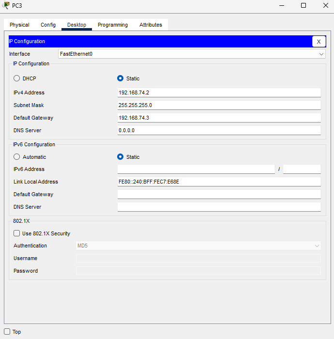

# Practica 2 - Manual Técnico
---
UNIVERSIDAD DE SAN CARLOS DE GUATEMALA  
FACULTAD DE INGENIERÍA  
ESCUELA DE CIENCIAS Y SISTEMAS  
REDES DE COMPUTADORAS 2  
ING. ALLAN ALBERTO MORATAYA GÓMEZ  
AUX: EDUARDO IXÉN  

---

## Integrantes

| Nombre                                | Carnet    |
|:------------------------------------- |:---------:|
| [Luis Fernando Falla Guzmán](https://github.com/fernandofalla)          | 201700700 |
| [Cristofher Antonio Saquilmer Rodas](https://github.com/CristofherS)    | 201700686 |
| [Pedro Luis Pu Tavico](https://github.com/luis-tavico)                  | 202000562 |
| [Camilo Ernesto Sincal Sipac](https://github.com/CamiloSincal)          | 202000605 |

## Introducción
Este manual presenta los resultados obtenidos de la practica 2 del curso redes de computadoras 2, la cual se enfoca en la configuracion de redes MAN y LAN de la universidad San Carlos de Guatemala (USAC) utilizando la plataforma Packet Tracer.

## Objetivos
- Realizar configuraciones básicas de switches multicapa y switches capa 2.
- Familiarizarse con protocolos de capa 3: OSPF y EIGRP.
- Familiarizarse con redes MAN y LAN.
- Implementar mecanismos de seguridad en switches, enfocados en la protección de la red a nivel de capa 3.
- Conocer y configurar LACP para el aumento de ancho de banda y la redundancia.
- Conocer e implementar la seguridad básica de un switch.

## Topología


## VLAN's

| Departamento  | VLAN  |
|---------------|-------|
| SOPORTE       | 14    |
| VISITANTES    | 24    |
| RECURSOS      | 34    |

## Direcciones de Red

| Direccion de red | VLAN       | Edificio   |
|------------------|------------|------------|
| 192.168.14.0 /24 | RECURSOS   | M2         |
| 192.168.24.0 /24 | VISITANTES | M2         |
| 192.168.34.0 /24 | RECURSOS   | T3         |
| 192.168.44.0 /24 | SOPORTE    | T3         |
| 192.168.54.0 /24 | RECURSOS   | T9         |
| 192.168.64.0 /24 | VISITANTES | T9         |
| 192.168.74.0 /24 | RECURSOS   | BIBLIOTECA |
| 192.168.84.0 /24 | VISITANTES | BIBLIOTECA |

## Configuración de switches capa 2

### Configuracion de VLANs y enlaces troncales

### Switch0 

```
enable 
configure terminal
vlan 14
name SOPORTE
exit
vlan 24
name VISITANTES
exit
vlan 34
name RECURSOS
interface FastEthernet 0/10
switchport mode trunk
switchport trunk allowed vlan all
exit
interface FastEthernet 0/1
switchport mode acces
switcport acces vlan 34
exit
interface FastEthernet 0/2
switchport mode acces
switcport acces vlan 24
end
wr
```

### Switch1

```
enable 
configure terminal
vlan 14
name SOPORTE
exit
vlan 24
name VISITANTES
exit
vlan 34
name RECURSOS
interface FastEthernet 0/10
switchport mode trunk
switchport trunk allowed vlan all
exit
interface FastEthernet 0/1
switchport mode acces
switcport acces vlan 34
exit
interface FastEthernet 0/2
switchport mode acces
switcport acces vlan 14
end
wr
```

### Switch2 

```
enable 
configure terminal
vlan 14
name SOPORTE
exit
vlan 24
name VISITANTES
exit
vlan 34
name RECURSOS
interface FastEthernet 0/10
switchport mode trunk
switchport trunk allowed vlan all
exit
interface FastEthernet 0/1
switchport mode acces
switcport acces vlan 34
exit
interface FastEthernet 0/2
switchport mode acces
switcport acces vlan 24
end
wr
```

### Switch3 

```
enable 
configure terminal
vlan 14
name SOPORTE
exit
vlan 24
name VISITANTES
exit
vlan 34
name RECURSOS
interface FastEthernet 0/10
switchport mode trunk
switchport trunk allowed vlan all
exit
interface FastEthernet 0/2
switchport mode acces
switcport acces vlan 34
exit
interface FastEthernet 0/1
switchport mode acces
switcport acces vlan 24
end
wr
```

## Configuración de switches capa 3

### OSPF

#### Configuracion de VLANs

#### Multilayer Switch0

```
enable 
configure terminal
vlan 14
name SOPORTE
exit
vlan 24
name VISITANTES
exit
vlan 34
name RECURSOS
interface range FastEthernet 0/10-13
switchport trunk encapsulation dot1q
switchport mode trunk
switchport trunk allowed vlan all
exit
interface FastEthernet 0/1
switchport trunk encapsulation dot1q
switchport mode trunk
switchport trunk allowed vlan all
```

#### Multilayer Switch1

```
enable 
configure terminal
vlan 14
name SOPORTE
exit
vlan 24
name VISITANTES
exit
vlan 34
name RECURSOS
interface range FastEthernet 0/10-21
switchport trunk encapsulation dot1q
switchport mode trunk
switchport trunk allowed vlan all
exit
interface FastEthernet 0/1
switchport trunk encapsulation dot1q
switchport mode trunk
switchport trunk allowed vlan all
```

#### Multilayer Switch2

```
enable 
configure terminal
vlan 14
name SOPORTE
exit
vlan 24
name VISITANTES
exit
vlan 34
name RECURSOS
interface range FastEthernet 0/10-13
switchport trunk encapsulation dot1q
switchport mode trunk
switchport trunk allowed vlan all
exit
interface FastEthernet 0/1
switchport trunk encapsulation dot1q
switchport mode trunk
switchport trunk allowed vlan all
```

#### Multilayer Switch3

```
enable 
configure terminal
vlan 14
name SOPORTE
exit
vlan 24
name VISITANTES
exit
vlan 34
name RECURSOS
interface range FastEthernet 0/10-13
switchport trunk encapsulation dot1q
switchport mode trunk
switchport trunk allowed vlan all
exit
interface FastEthernet 0/1
switchport trunk encapsulation dot1q
switchport mode trunk
switchport trunk allowed vlan all
```

#### Configuracion OSPF

#### Multilayer Switch0

```
enable
configure terminal
interface vlan 24
ip address 192.168.24.3 255.255.255.0
ip ospf 1 area 4
exit
interface vlan  34
ip address 192.168.14.3 255.255.255.0
ip ospf 1 area 4
exit
interface portchannel 1
ip ospf 1 area 4
exit
router ospf 1
network 192.168.24.0 0.0.0.255 area 4
network 192.168.14.0 0.0.0.255 area 4
network 192.168.114.0 0.0.0.255 area 4
end
wr
```

#### Multilayer Switch1

```
enable
configure terminal
interface vlan 14
ip address 192.168.44.3 255.255.255.0
ip ospf 1 area 4
exit
interface vlan  34
ip address 192.168.34.3 255.255.255.0
ip ospf 1 area 4
exit
interface portchannel 1
ip ospf 1 area 4
exit
interface portchannel 2
ip ospf 1 area 4
exit
interface portchannel 3
ip ospf 1 area 4
exit
router ospf 1
network 192.168.44.0 0.0.0.255 area 4
network 192.168.34.0 0.0.0.255 area 4
network 192.168.94.0 0.0.0.255 area 4
network 192.168.104.0 0.0.0.255 area 4
network 192.168.114.0 0.0.0.255 area 4
end
wr
```

#### Multilayer Switch2

```
enable
configure terminal
interface vlan 24
ip address 192.168.64.3 255.255.255.0
ip ospf 1 area 4
exit
interface vlan  34
ip address 192.168.54.3 255.255.255.0
ip ospf 1 area 4
exit
interface portchannel 2
ip ospf 1 area 4
exit
router ospf 1
network 192.168.64.0 0.0.0.255 area 4
network 192.168.54.0 0.0.0.255 area 4
network 192.168.94.0 0.0.0.255 area 4
end
wr
```

#### Multilayer Switch3

```
enable
configure terminal
interface vlan 24
ip address 192.168.84.3 255.255.255.0
ip ospf 1 area 4
exit
interface vlan  34
ip address 192.168.74.3 255.255.255.0
ip ospf 1 area 4
exit
interface portchannel 3
ip ospf 1 area 4
exit
router ospf 1
network 192.168.84.0 0.0.0.255 area 4
network 192.168.74.0 0.0.0.255 area 4
network 192.168.104.0 0.0.0.255 area 4
end
wr
```

#### Autenticacion MD5

#### Multilayer Switch0

```
enable
configure terminal
interface vlan 24
ip ospf authentication message-digest
ip ospf message-digest-key 1 md5 redes2-g4
exit
interface vlan 34
ip ospf authentication message-digest
ip ospf message-digest-key 1 md5 redes2-g4
exit
interface port-channel 1
ip ospf authentication message-digest
ip ospf message-digest-key 1 md5 redes2-g4
end
wr
```

#### Multilayer Switch1

```
enable
configure terminal
interface vlan 14
ip ospf authentication message-digest
ip ospf message-digest-key 1 md5 redes2-g4
exit
interface vlan 34
ip ospf authentication message-digest
ip ospf message-digest-key 1 md5 redes2-g4
exit
interface port-channel 3
ip ospf authentication message-digest
ip ospf message-digest-key 1 md5 redes2-g4
interface port-channel 2
ip ospf authentication message-digest
ip ospf message-digest-key 1 md5 redes2-g4
interface port-channel 1
ip ospf authentication message-digest
ip ospf message-digest-key 1 md5 redes2-g4
end
wr
```

#### Multilayer Switch2

```
enable
configure terminal
interface vlan 24
ip ospf authentication message-digest
ip ospf message-digest-key 1 md5 redes2-g4
exit
interface vlan 34
ip ospf authentication message-digest
ip ospf message-digest-key 1 md5 redes2-g4
exit
interface port-channel 2
ip ospf authentication message-digest
ip ospf message-digest-key 1 md5 redes2-g4
end
wr
```

#### Multilayer Switch3

```
enable
configure terminal
interface vlan 24
ip ospf authentication message-digest
ip ospf message-digest-key 1 md5 redes2-g4
exit
interface vlan 34
ip ospf authentication message-digest
ip ospf message-digest-key 1 md5 redes2-g4
exit
interface port-channel 3
ip ospf authentication message-digest
ip ospf message-digest-key 1 md5 redes2-g4
end
wr
```

#### Configuracion de LACP

#### Multilayer Switch0

```
enable
configure terminal
interface range fastEthernet 0/10-13
channel-protocol lacp
channel-group 1 mode active
no switchport
ip address 192.168.114.3 255.255.255.0
end
wr
```

#### Multilayer Switch1

```
enable
configure terminal
interface range fastEthernet 0/10-13
channel-protocol lacp
channel-group 1 mode active
no switchport
ip address 192.168.114.2 255.255.255.0
exit
interface range fastEthernet 0/14-17
channel-protocol lacp
channel-group 2 mode active
no switchport
ip address 192.168.94.2 255.255.255.0
exit
interface range fastEthernet 0/18-21
channel-protocol lacp
channel-group 3 mode active
no switchport
ip address 192.168.104.2 255.255.255.0
end
wr
```

#### Multilayer Switch2

```
enable
configure terminal
interface range fastEthernet 0/10-13
channel-protocol lacp
channel-group 2 mode active
no switchport
ip address 192.168.94.3 255.255.255.0
end
wr
```

#### Multilayer Switch3

```
enable
configure terminal
interface range fastEthernet 0/10-13
channel-protocol lacp
channel-group 3 mode active
no switchport
ip address 192.168.104.2 255.255.255.0
end
wr
```

#### Configuracion de Acces List

#### Multilayer Switch0

```
enable
configure terminal
access-list 100 deny icmp 192.168.24.0 0.0.0.255 any echo
access-list permit ip any any
interface port-channel 1
ip access-group 100 out
exit
access-list 101 deny icmp 192.168.24.0 0.0.0.255 192.168.14.0 0.0.0.255 echo
access-list permit ip any any
interface vlan 24
ip access-group 101 in
exit
access-list 102 deny icmp 192.168.14.0 0.0.0.255 192.168.24.0 0.0.0.255 echo
access-list 102 deny icmp 192.168.14.0 0.0.0.255 192.168.84.0 0.0.0.255 echo
access-list 102 deny icmp 192.168.14.0 0.0.0.255 192.168.64.0 0.0.0.255 echo
access-list permit ip any any
interface vlan 34
ip access-group 102 in
```

#### Multilayer Switch1

```
enable
configure terminal
access-list 101 deny icpm any 192.168.44.0 0.0.0.255 any echo
access-list permit ip any any
exit
interface port-channel 1
ip acces-group 101 in
exit
interface port-channel 2
ip acces-group 101 in
exit
interface port-channel 3
ip acces-group 101 in
exit
access-list 102 deny icpm 192.168.34.0 0.0.0.255 192.168.44.0 0.0.0.255 echo
access-list 102 deny icpm 192.168.34.0 0.0.0.255 192.168.24.0 0.0.0.255 echo
access-list 102 deny icpm 192.168.34.0 0.0.0.255 192.168.84.0 0.0.0.255 echo
access-list 102 deny icpm 192.168.34.0 0.0.0.255 192.168.64.0 0.0.0.255 echo
access-list permit ip any any
interface vlan 34
ip access-group 102 in
```

#### Multilayer Switch2

```
enable
configure terminal
access-list 100 deny icmp 192.168.64.0 0.0.0.255 any echo
access-list permit ip any any
interface port-channel 2
ip access-group 100 out
exit
access-list 101 deny icmp 192.168.64.0 0.0.0.255 192.168.54.0 0.0.0.255 echo
access-list 102 permit ip any any
interface vlan 24
ip access-group 101 in
exit
access-list 102 deny icmp 192.168.54.0 0.0.0.255 192.168.64.0 0.0.0.255 echo
access-list 102 deny icmp 192.168.54.0 0.0.0.255 192.168.84.0 0.0.0.255 echo
access-list 102 deny icmp 192.168.54.0 0.0.0.255 192.168.24.0 0.0.0.255 echo
access-list 102 permit ip any any
interface vlan 34
ip access-group 102 in
```

#### Multilayer Switch3

```
enable
configure terminal
access-list 100 deny icmp 192.168.84.0 0.0.0.255 any echo
access-list permit ip any any
exit
interface port-channel 3
ip access-group 100 out
exit
access-list 101 deny icmp 192.168.84.0 0.0.0.255 192.168.74.0 0.0.0.255 echo
access-list 102 permit ip any any
interface vlan 24
ip access-group 101 in
exit
access-list 102 deny icmp 192.168.74.0 0.0.0.255 192.168.24.0 0.0.0.255 echo
access-list 102 deny icmp 192.168.74.0 0.0.0.255 192.168.84.0 0.0.0.255 echo
access-list 102 deny icmp 192.168.74.0 0.0.0.255 192.168.64.0 0.0.0.255 echo
access-list 102 permit ip any any
interface vlan 34
ip access-group 102 in >
```

### EIGRP

#### Multilayer Switch0

```
enable
configure terminal
vlan 14
name SOPORTE
vlan 24
name VISITANTES
int vlan 14
ip address 192.168.14.1 255.255.255.0
no shutdown
int vlan 24
ip address 192.168.24.1 255.255.255.0
no shutdown
int port-channel 1
switchport mode trunk
switchport trunk allowed vlan 14,24
ip routing
router eigrp 4
network 192.168.14.0 0.0.0.255
network 192.168.24.0 0.0.0.255
no auto-summary
```

#### Multilayer Switch1

```
enable
configure terminal
vlan 34
name RECURSOS
vlan 44
name SOPORTE
int vlan 34
ip address 192.168.34.1 255.255.255.0
no shutdown
int vlan 44
ip address 192.168.44.1 255.255.255.0
no shutdown
vlan 14
name SOPORTE
vlan 24
name VISITANTES
int vlan 14
ip address 192.168.14.1 255.255.255.0
no shutdown
int vlan 24
ip address 192.168.24.1 255.255.255.0
no shutdown
int port-channel 1
switchport mode trunk
switchport trunk allowed vlan 14,24
vlan 54
name RECURSOS
vlan 64
name VISITANTES
int vlan 54
ip address 192.168.54.1 255.255.255.0
no shutdown
int vlan 64
ip address 192.168.64.1 255.255.255.0
no shutdown
int port-channel 2
switchport mode trunk
switchport trunk allowed vlan 54,64
vlan 74
name RECURSOS
vlan 84
name VISITANTES
int vlan 74
ip address 192.168.74.1 255.255.255.0
no shutdown
int vlan 84
ip address 192.168.84.1 255.255.255.0
no shutdown
int port-channel 3
switchport mode trunk
switchport trunk allowed vlan 84,74
ip routing
router eigrp 4
network 192.168.14.0 0.0.0.255
network 192.168.24.0 0.0.0.255
network 192.168.34.0 0.0.0.255
network 192.168.44.0 0.0.0.255
network 192.168.54.0 0.0.0.255
network 192.168.64.0 0.0.0.255
network 192.168.74.0 0.0.0.255
network 192.168.84.0 0.0.0.255
no auto-summary
```

#### Multilayer Switch2

```
enable
configure terminal
vlan 54
name RECURSOS
vlan 64
name VISITANTES
int vlan 54
ip address 192.168.54.1 255.255.255.0
no shutdown
int vlan 64
ip address 192.168.64.1 255.255.255.0
no shutdown
int port-channel 2
switchport mode trunk
switchport trunk allowed vlan 54,64
ip routing
router eigrp 4
network 192.168.54.0 0.0.0.255
network 192.168.64.0 0.0.0.255
no auto-summary
```

#### Multilayer Switch3

```
enable
configure terminal
vlan 74
name RECURSOS
vlan 84
name VISITANTES
int vlan 74
ip address 192.168.74.1 255.255.255.0
no shutdown
int vlan 84
ip address 192.168.84.1 255.255.255.0
no shutdown
int port-channel 3
switchport mode trunk
switchport trunk allowed vlan 84,74
ip routing
router eigrp 4
network 192.168.74.0 0.0.0.255
network 192.168.84.0 0.0.0.255
no auto-summary
```

## IPs asignadas





## Ping entre hosts

### Edificio M2

#### VISITANTES


La imagen anterior representa el ping realizado de la VPC 192.168.24.2 (VISITANTES) a la VPC 192.168.64.2 (VISITANTES).

#### RECURSOS


La imagen anterior representa el ping realizado de la VPC 192.168.14.2 (RECURSOS) a la VPC 192.168.54.2 (RECURSOS).

### Edificio T3

#### SOPORTE


La imagen anterior representa el ping realizado de la VPC 192.168.44.2 (SOPORTE) a la VPC 192.168.14.2 (RECURSOS).

#### RECURSOS


La imagen anterior representa el ping realizado de la VPC 192.168.34.2 (RECURSOS) a la VPC 192.168.14.2 (RECURSOS).

### Edificio T9

#### VISITANTES


La imagen anterior representa el ping realizado de la VPC 192.168.64.2 (VISITANTES) a la VPC 192.168.24.2 (VISITANTES).

#### RECURSOS


La imagen anterior representa el ping realizado de la VPC 192.168.54.2 (RECURSOS) a la VPC 192.168.34.2 (RECURSOS).

### Biblioteca Central

#### VISITANTES


La imagen anterior representa el ping realizado de la VPC 192.168.84.2 (VISITANTES) a la VPC 192.168.64.2 (VISITANTES).

#### RECURSOS


La imagen anterior representa el ping realizado de la VPC 192.168.74.2 (RECURSOS) a la VPC 192.168.54.2 (RECURSOS).